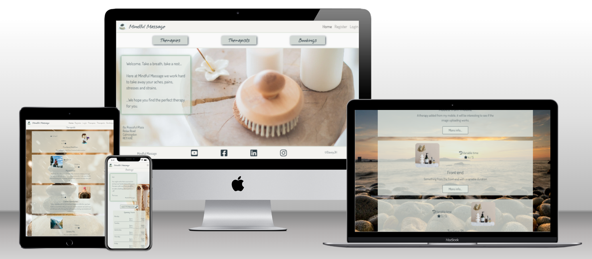
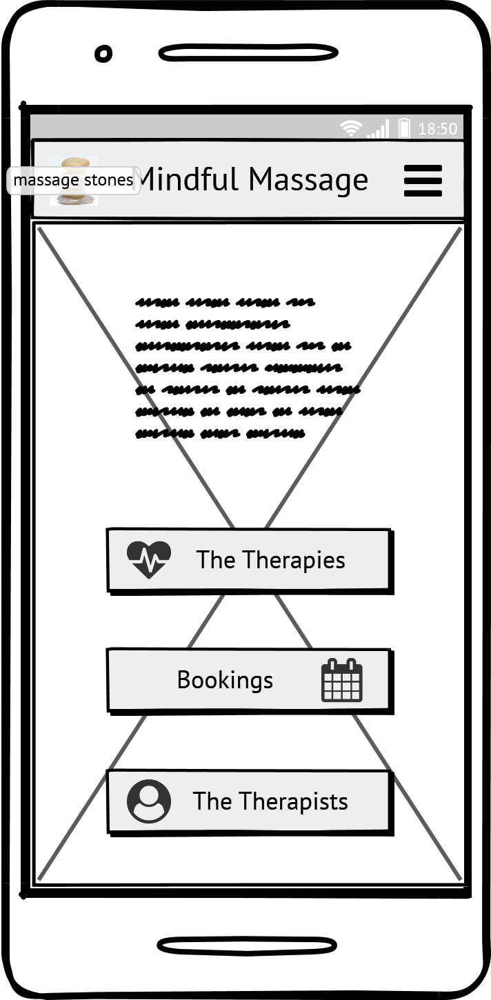
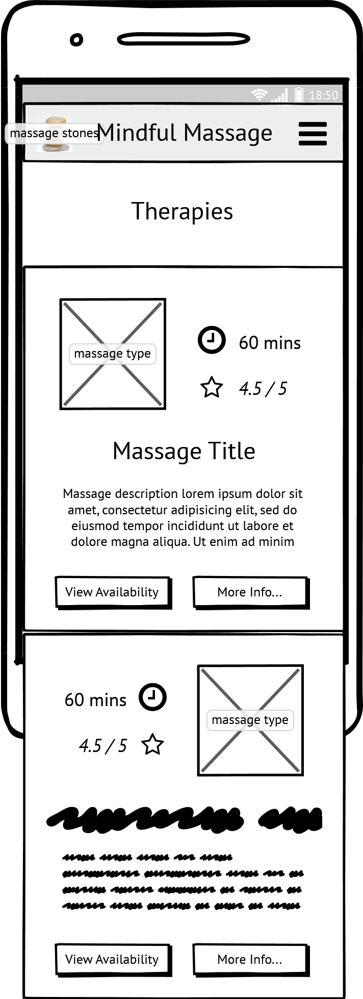
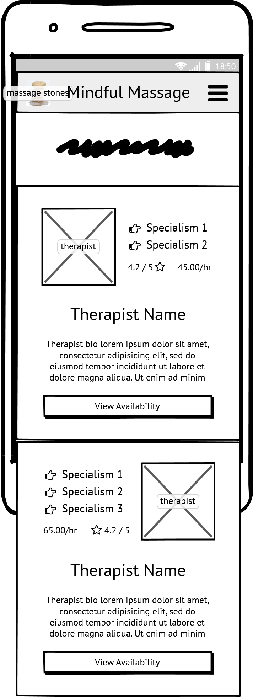
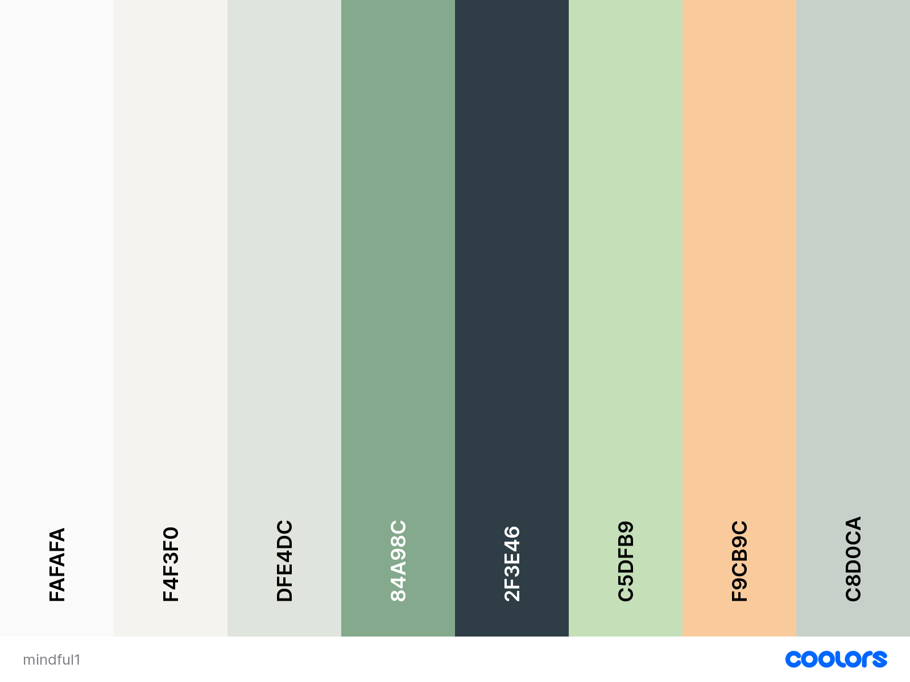
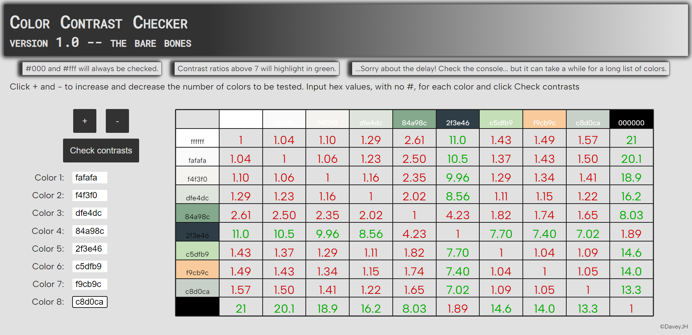

# Mindful Massage

## Live Site

|Heroku|:|Render|
|--|-|--:|
|[Mindful Massage on Heroku](https://mindful-massage.herokuapp.com)|:|[Mindful Massage on Render](https://mindful-massage.onrender.com)|

## Repository

[GitHub hosted repository](https://github.com/DaveyJH/ci-portfolio-four)
***

## Table of Contents

- [Mindful Massage](#mindful-massage)
  - [Live Site](#live-site)
  - [Repository](#repository)
  - [Table of Contents](#table-of-contents)
  - [Objective](#objective)
  - [Brief](#brief)
  - [UX &#8722; User Experience Design](#ux--user-experience-design)
    - [User Requirements](#user-requirements)
    - [Initial Concept](#initial-concept)
      - [Wireframes](#wireframes)
        - [Samples from Mobile](#samples-from-mobile)
        - [Complete wireframes](#complete-wireframes)
      - [Colour Scheme](#colour-scheme)
        - [Contrast](#contrast)
      - [Typography](#typography)
        - [Headings](#headings)
        - [Body](#body)
      - [Imagery](#imagery)
  - [Features](#features)
    - [Existing Features](#existing-features)
    - [Features Left to Implement](#features-left-to-implement)
  - [Technologies Used](#technologies-used)
  - [Testing](#testing)
  - [Bugs](#bugs)
    - [Current](#current)
    - [Resolved](#resolved)
  - [Development](#development)
  - [Deployment](#deployment)
  - [Credits](#credits)
    - [Content](#content)
    - [Media](#media)
    - [Acknowledgements](#acknowledgements)
    - [Personal Development](#personal-development)

***

## Objective

This site is to represent capabilities with the django framework. It should
employ full Create, Read, Update, Delete (CRUD) functionality.

***The needs within this project are not genuine and are made purely for the
purpose of completing my Code Institute fourth project***

***

## Brief

Mindful Massage : a massage therapist and therapies site. The site should show
the therapists employed at (the entirely made up) Mindful Massage Spa, as well
as the therapies offered. Users should be able to sign in and leave reviews, as
well as view reviews left by others.

Full CRUD functionality should be achievable through the front-end of the site,
with different levels of user having specific actions and interactions.

***

## UX &#8722; User Experience Design

### User Requirements

The original user stories were based on psuedo personas created for the project.
Due to time constraints and other priorities, the scope of the project has been
reduced from the initial conception and is well documented through version
control. The original user
[personas are viewable here.](https://github.com/DaveyJH/ci-portfolio-four/wiki/User-Personas)

[Issues](https://github.com/DaveyJH/ci-portfolio-four/issues?q=is%3Aissue+is%3Aclosed+label%3A%22user+story%22)
were created for the initial concepts that were to be included within the site.
Each issue consists of a user type, referencing the persona document linked
above, a required functionality and the benefit it provides.

***

### Initial Concept

The intital idea of the site was to provide a digital booking system, combining
reviews and ratings, for a massage spa. Due to time constraints, a lot of the
functionality has been removed. As a result, the scope has been reassessed
throughout the development process to ensure a minimum viable product is
created.

In the 'ideal world', the site would have had unique booking slots available to
each therapist, allowing separate diaries for each. This would have allowed a
business advisor to review the types of bookings that are being made and could
lead to business adjustments to maximise profits. As stated, the time
constraints imposed by external factors meant that I decided very early to
negate the complexity of involving dates and times with regard to front-end
rendering. This allowed a rapid development of more simplified functionality.

#### Wireframes

Initial wireframes were made for the original conception idea. As functionality
was reduced, these wireframes have also become guidelines for the more basic
functions and remain in place for future development. The wireframes were
designed using 
<!-- todo add link -->
Balsamiq, with a mobile-first approach.

##### Samples from Mobile

|Home|Therapies|Therapists|
|:-:|:-:|:-:|
||||

##### Complete wireframes

*[See main wireframes here](./docs/design/mindful_massage_wireframes.pdf)*

Other wireframes are viewable in the
[`docs/design/`](https://github.com/DaveyJH/ci-portfolio-four/tree/main/docs/design)
directory on GitHub. The original Balasmiq file is also available there which
has comments that describe some of the sections.

***

#### Colour Scheme

A light colour scheme was chosen to match the ersatz colour scheme of the Spa.
The light colours allow a good contrast with text and give a clean feel
throughout the site. Colours were checked with a contrast checker during the
design process to make sure they meet accessibility requirements.

##### Contrast

The chart shown below was generated via
[a site I produced](https://daveyjh.github.io/Color-Contrast-Checker/) that
allows multiple colours to be checked against each other in one action, rather
than having to input values repeatedly. The chart was referenced throughout the
design and styling process to ensure high contrasts were maintained. Some
tranpsarency has been applied in places, and thus, the resulting colours have
been checked via the use of the eye dropper tool,
<!-- todo link to eyedropper/tech used -->
mentioned in the technologies used section, and a one-hit contrast check.

***

#### Typography

To maintain a relaxing and peaceful theme, the main font used throughout the
site is not complex. It allows easy reading and does not detract from the
overall feel of the site. To add a little more style, the headings and some
links/buttons have a slightly cursive font that still remains, largely, easy to
read.

Both fonts are from Google fonts, meaning they can be imported via their API and
giving wide coverage to keep the styling maintained across various devices.

##### Headings

Grape Nuts  

##### Body

Dosis  

<!-- typography -->
***

#### Imagery

The imagery used throughout the site is intended to maintain the peaceful,
calming nature. All static images are sourced through
[Pexels.com](https://www.pexels.com/) and are royalty free. There is a list of
images used, and inspirational/trial images considered, available on the
[media wiki here](https://github.com/DaveyJH/ci-portfolio-four/wiki/Media-ideas).
At the time of writing, the images within the database also came from Pexels.

***

## Features

### Existing Features

<!-- - Feature 1 - allows users X to achieve Y, by having them fill out Z -->
<!-- 1. feature1
>*"User... **story quote**"*
- *explanation*-->
F1
***
<!-- - Feature 2 - allows users X to achieve Y, by having them fill out Z -->
<!-- 1. feature2
>*"User... **story quote**"*
- *explanation*
  
-->
F2
***

### Features Left to Implement

<!-- features left to implement -->
<!-- 1. Explain desired feature 1
  - *Notes regarding feature*
  - Explanation of feature need etc. -->
<!-- 2. Explain desired feature 2
  - *Notes regarding feature*
  - Explanation of feature need etc. -->
***

## Technologies Used

<!-- tech used -->
<!-- - *[techNameOne](techURL)*
       - Description -->
<!-- - *[techNameTwo](techURL)*
       - Description -->

## Testing

<!-- explain testing
? item tested
? expected result
? how test was performed
? actual result
? differences
? action required
? re-test
- more detail and better format required compared with project 1
look at daisy's testing documentation and [webinar](https://us02web.zoom.us/rec/play/9FIKllHX2ZiQNFRhYPn_hBh_ZeA8964ZvIDLnhpKGAf1NLVc3_hBJ6zSL8Hv5Hx7ALnPtDmbg8CmFAs.YVsZ9LR_uI7OjEwH)-->

<!-- validation of html, css and script. -->
<!-- lighthouse testing -->

## Bugs

### Current

<!-- current bugs -->

<!-- - bugOne explanation

*notes on explanation* -->
***
<!-- - bugTwo explanation

*notes on explanation* -->
***

### Resolved

<!-- resolved bugs -->
<!-- 1. bugOne

*Commit - **[sha](commit link with highlighted lines)** - explanation of fix* -->
***
<!-- 1. bugTwo

*Commit - **[sha](commit link with highlighted lines)** - explanation of fix* -->
***

## Development

<!-- section missed in first project. 
!describe development process -->

## Deployment

<!-- !check this section, may need adjusting as using additional languages -->

<!-- **Github Pages**
- Navigate to the relevant GitHub Repository [here](github repo URL)
- Select "Settings" from the options below the name of the repository

- Select "Pages" from the left hand menu

- Select "Branch: main" as the source and leave the directory as "/(root)"

- Click the Save button

- Take note of the URL provided

- GitHub takes a short while to publish the page. The bar turns green if you refresh the pages tab and the page has been deployed

- Click the link or copy the URL to a browser to reach the deployed page
https://daveyjh.github.io/ci-portfolio-one-v4/

The site is now live and operational -->
***

## Credits

### Content
<!-- - the a comes from b -->
<!-- - the c comes from d -->
### Media
<!-- - the a comes from b -->
<!-- - the c comes from d -->
### Acknowledgements
<!-- - acknowledge a, found at [b](bURL), for c -->
<!-- - acknowledge d, found at [e](eURL), for f -->
***

### Personal Development

<!-- notes -->