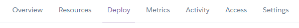
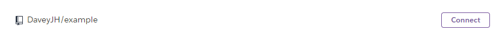

# Mindful Massage


## Live Site

|Heroku|:|Render|
|--|-|--:|
|[Mindful Massage on Heroku](https://mindful-massage.herokuapp.com)|:|[Mindful Massage on Render](https://mindful-massage.onrender.com)|

## Repository

[GitHub hosted repository](https://github.com/DaveyJH/ci-portfolio-four)
***

## Table of Contents

- [Mindful Massage](#mindful-massage)
  - [Live Site](#live-site)
  - [Repository](#repository)
  - [Table of Contents](#table-of-contents)
  - [Objective](#objective)
  - [Brief](#brief)
  - [UX &#8722; User Experience Design](#ux--user-experience-design)
    - [User Requirements](#user-requirements)
      - [First Time User](#first-time-user)
      - [Returning User](#returning-user)
        - [Client](#client)
        - [Staff](#staff)
      - [Owner](#owner)
      - [Developer](#developer)
    - [Initial Concept](#initial-concept)
      - [Wireframes](#wireframes)
        - [Samples from Mobile](#samples-from-mobile)
        - [Complete wireframes](#complete-wireframes)
      - [Colour Scheme](#colour-scheme)
        - [Contrast](#contrast)
      - [Typography](#typography)
        - [Headings](#headings)
        - [Body](#body)
      - [Imagery](#imagery)
  - [Features](#features)
    - [Existing Features](#existing-features)
    - [Features Left to Implement](#features-left-to-implement)
  - [Data Model](#data-model)
    - [PostgreSQL](#postgresql)
  - [Technologies Used](#technologies-used)
    - [Python Packages](#python-packages)
    - [Other Tech](#other-tech)
      - [*Bootstrap 5.2*](#bootstrap-52)
      - [*Instant Eyedropper*](#instant-eyedropper)
      - [*WebAIM Contrast Checker*](#webaim-contrast-checker)
      - [*Windows Snipping Tool*](#windows-snipping-tool)
      - [*Balsamiq*](#balsamiq)
      - [*Font Awesome*](#font-awesome)
      - [*Google Fonts*](#google-fonts)
      - [*Multi Device Mockup Generator*](#multi-device-mockup-generator)
      - [*W3C Markup Validation Service*](#w3c-markup-validation-service)
      - [*flake8*](#flake8)
      - [*Visual Studio Code*](#visual-studio-code)
      - [VSCode Extensions](#vscode-extensions)
  - [Testing](#testing)
  - [Bugs](#bugs)
    - [Current](#current)
    - [Resolved](#resolved)
  - [Development](#development)
    - [GitHub](#github)
    - [VSCode](#vscode)
      - [Cloning](#cloning)
      - [Editing](#editing)
    - [Working With Python](#working-with-python)
      - [Venv](#venv)
      - [Packages](#packages)
    - [Django](#django)
      - [Creation](#creation)
      - [Server](#server)
      - [.env](#env)
    - [Agile Process](#agile-process)
  - [Deployment](#deployment)
    - [Heroku](#heroku)
    - [Render](#render)
      - [Changes to repo for Render](#changes-to-repo-for-render)
      - [Deployment to Render](#deployment-to-render)
  - [Credits](#credits)
    - [Content](#content)
    - [Media](#media)
    - [Acknowledgements](#acknowledgements)
    - [Personal Development](#personal-development)

***

## Objective

This site is to represent capabilities with the Django framework. It should
employ full Create, Read, Update, Delete (CRUD) functionality.

The assessment checklist is available to view in the
[`docs/` directory](https://github.com/DaveyJH/ci-portfolio-four/tree/main/docs)
of the project repository.

***The needs within this project are not genuine and are made purely for the
purpose of completing my Code Institute fourth project***

***

## Brief

Mindful Massage : a massage therapist and therapies site. The site should show
the therapists employed at (the entirely made up) Mindful Massage Spa, as well
as the therapies offered. Users should be able to sign in and leave reviews, as
well as view reviews left by others.

Full CRUD functionality should be achievable through the front-end of the site,
with different levels of users having specific actions and interactions.

***

## UX &#8722; User Experience Design

### User Requirements

The original user stories were based on pseudo personas created for the project.
Due to time constraints and other priorities, the scope of the project has been
reduced from the initial conception and is well documented through version
control. The original user
[personas are viewable here.](https://github.com/DaveyJH/ci-portfolio-four/wiki/User-Personas)

[Epics](https://github.com/DaveyJH/ci-portfolio-four/issues?q=is%3Aissue+label%3A%22user+story%22+-label%3Atest+label%3Aepic+)
were created for the initial concepts that were to be included within the site.
Each epic issue consists of a user type, referencing the persona document linked
above, a required functionality and the benefit it provides. The original user
epics have been broken down into smaller issues for the development process.

As part of the testing procedure, I wrote very
[granular user stories](https://github.com/DaveyJH/ci-portfolio-four/issues?q=is%3Aissue+label%3A%22user+story%22+-label%3Aepic+-label%3Atest)
to ensure all functionality was as expected. Note that I have referenced this in
the [personal development](#personal-development) section at the end of this
document.

Below is a non-exhaustive list of some of the user stories:

#### First Time User

> *"As a potential customer, I would like to know what the site is about"*
>
> *"As a non-registered user, I would like to explore some of the site"*
>
> *"As a non-registered user, I would like to be able to sign up"*
>
> *"As a potential customer, I would like to view the main services offered"*

#### Returning User

##### Client

> *"As a returning user, I would like to be able to log in to my account"*
>
> *"As a returning user, I would like to be able to view reviews written by me"*
>
> *"As a returning user, I would like to be able to edit reviews written by me"*
>
> *"As a returning user, I would like to be able to delete reviews written by
> me"*

##### Staff

> *"As a staff member, I would like to be able to log in to my account"*
>
> *"As a staff member, I would like to be able to view reviews written about
> me in one location"*
>
> *"As a staff member, I would like other users to be able to view some
> information about me"*

#### Owner

> *"As the owner, I would like to be able to add therapists"*
>
> *"As the owner, I would like to be able to add therapies"*
>
> *"As the owner, I would like to be able to edit therapists"*
>
> *"As the owner, I would like to be able to edit therapies"*
>
> *"As the owner, I would like to be able to delete therapists"*
>
> *"As the owner, I would like to be able to delete therapies"*
>
> *"As the owner, I would like to be able to approve reviews"*
>
> *"As the owner, I would like to provide contact info for my business"*
>
> *"As the owner, I would like to be able to update the business info"*

#### Developer

> *"As the developer, I would like to ensure the site meets the essential user
> requirements"*

***

### Initial Concept

The initial idea of the site was to provide a digital booking system, combining
reviews and ratings, for a massage spa. Due to time constraints, a lot of the
functionality has been removed. As a result, the scope has been reassessed
throughout the development process to ensure a minimum viable product is
created.

In the 'ideal world', the site would have had unique booking slots available to
each therapist, allowing separate diaries for each. This would have allowed a
business advisor to review the types of bookings that are being made and could
lead to business adjustments to maximise profits. As stated, the time
constraints imposed by external factors meant that I decided very early to
negate the complexity of involving dates and times with regard to front-end
rendering. This allowed rapid development of more simplified functionality.

***

#### Wireframes

Initial wireframes were made for the original conception idea. As functionality
was reduced, these wireframes have also become guidelines for the more basic
functions and remain in place for future development. The wireframes were
designed using [Balsamiq](#balsamiq), with a mobile-first approach.

##### Samples from Mobile

|Home|Therapies|Therapists|
|:-:|:-:|:-:|
||||

##### Complete wireframes

*[See main wireframes here](./docs/design/mindful_massage_wireframes.pdf)*

Other wireframes are viewable in the
[`docs/design/`](https://github.com/DaveyJH/ci-portfolio-four/tree/main/docs/design)
directory on GitHub. The original Balasmiq file is also available there which
has comments that describe some of the sections.

***

#### Colour Scheme

A light colour scheme was chosen to match the ersatz colour scheme of the Spa.
The light colours allow a good contrast with text and give a clean feel
throughout the site. Colours were checked with a contrast checker during the
design process to make sure they meet accessibility requirements.


##### Contrast

The chart shown below was generated via
[a site I produced](https://daveyjh.github.io/Color-Contrast-Checker/) that
allows multiple colours to be checked against each other in one action, rather
than having to input values repeatedly. The chart was referenced throughout the
design and styling process to ensure high contrasts were maintained. Some
transparency has been applied in places, and thus, the resulting colours have
been checked via the use of the [eye dropper tool](#instant-eyedropper),
mentioned in the technologies used section, and a
[one-hit contrast check](#webaim-contrast-checker).


***

#### Typography

To maintain a relaxing and peaceful theme, the main font used throughout the
site is not complex. It allows easy reading and does not detract from the
overall feel of the site. To add a little more style, the headings and some
links/buttons have a slightly cursive font that still remains, largely, easy to
read.

Both fonts are from [Google fonts](#google-fonts), meaning they can be imported
via their API and giving wide coverage to keep the styling maintained across
various devices.

##### Headings

Grape Nuts  


##### Body

Dosis  


***

#### Imagery

The imagery used throughout the site is intended to maintain a peaceful,
calming nature. All static images are sourced through
[Pexels.com](https://www.pexels.com/) and are royalty-free. There is a list of
images used, and inspirational/trial images considered, available on the
[media wiki here](https://github.com/DaveyJH/ci-portfolio-four/wiki/Media-ideas).
At the time of writing, the images within the database also came from Pexels.

***

## Features

### Existing Features

<!-- - Feature 1 - allows users X to achieve Y, by having them fill out Z -->
<!-- 1. feature1
>*"User... **story quote**"*
- *explanation*-->
F1
***
<!-- - Feature 2 - allows users X to achieve Y, by having them fill out Z -->
<!-- 1. feature2
>*"User... **story quote**"*
- *explanation*
  
-->
F2
***

### Features Left to Implement

<!-- features left to implement -->
<!-- 1. Explain desired feature 1
  - *Notes regarding feature*
  - Explanation of feature need etc. -->
<!-- 2. Explain desired feature 2
  - *Notes regarding feature*
  - Explanation of feature need etc. -->
***

## Data Model
<!-- todo add link to lucidchart in tech used -->

After the initial conceptualisation of the site, an entity relationship
diagram(ERD) was generated using LucidChart. Being my first project using a
relational database, this was a new concept to get to grips with and I suspect
has not been done in the best way.


As the project developed and the scope changed, the ERD became less accurate to
the end model. It acted as brilliant guidance and helped me to get the base
structure of the database created at an early stage, however, it is not quite
accurate for the final database structure.

I was able to generate an ERD from the database as it has ended up, and I am
fairly happy with how similar my initial thoughts were to the end result. One
thing I note is that, due to using functions to generate the average ratings,
these are not present on the ERD. Many of the `all_auth` entities have been
excluded from this diagram as they are not being used. Another consideration is
that I have excluded the original booking entity as it does not feature in this
iteration of deployment.


PDF versions of the displayed original ERD and the generated ERD (including
bookings) are available in the
[`docs/erd/` directory](https://github.com/DaveyJH/ci-portfolio-four/tree/main/docs/design/erd)
in the GitHub repository.

### PostgreSQL
<!-- todo add link to postgresql -->
A relational database was needed for the site, and as such, PostgreSQL was
chosen. As a widely implemented database platform, the documentation available
for working with this is quite extensive and there are many extensions available
to assist with its use. Due to the use of `ArrayField`s within the models, I was
unable to use the generated `db.sqlite3` instance, that is installed when
initialising Django, for development. Instead, I used a database hosted on
ElephantSQL and successfully transfered the majority of data from that
development database into the deployed database hosted on Heroku.

As the site was deployed to two hosting platforms (due to uncertainty with the
future of free tiers available with Heroku) I have opted to maintain the Render
instance with the use of the development database, thus all 'test' entries have
been purged and 'real' data has been added.

This document does not included the steps to create the database instances,
documentation is widely available for this and varies depending on the vendor.

## Technologies Used

### Python Packages

|Package|Use|
|--:|--|
|[django](https://www.djangoproject.com/)|web framework that encourages rapid development and clean, pragmatic design. django version 3.2 was used as this is the current version with long term support (LTS)|
|[dj3-cloudinary-storage](https://pypi.org/project/dj3-cloudinary-storage/)|facilitates integration with Cloudinary|
|[cloudinary](https://pypi.org/project/cloudinary/)|easy uploading of images to Cloudinary|
|[django-crispy-forms](https://pypi.org/project/django-crispy-forms/)|allows DRY forms to be created rapidly through HTML templates|
|[django-summernote](https://pypi.org/project/django-summernote/)|allows use of text-rich editors for form inputs|
|[python-dotenv](https://pypi.org/project/python-dotenv/)|reads key-value pairs from a `.env` file. Negates the need to write a Python file for environment variables (as would be done in an `env.py` file)|
|[gunicon](https://pypi.org/project/gunicorn/)|natively suuports Django to allow use of commands|
|[psycopg2](https://pypi.org/project/psycopg2/)|PostgreSQL database adapter for Python|
|[django-phonenumber-field](https://pypi.org/project/django-phonenumber-field/)|allows storing of configurable telephone numbers in Django models|
|[whitenoise](https://pypi.org/project/whitenoise/)|allows easy implementation of static files|
|||

*For a full list of installed Python packages, see
[`requirements.txt`](.txthttps://github.com/DaveyJH/ci-portfolio-four/blob/main/requirements.txt)*

Most packages have relevant documentation hosted on the
[Python package index](https://pypi.org/) site. More expansive docs are found
for many of the packages at [Read the Docs](https://readthedocs.org/)

***

### Other Tech

#### *[Bootstrap 5.2](https://getbootstrap.com/docs/5.2/getting-started/introduction/)*

Bootstrap is a powerful, feature-packed frontend toolkit. It has many classes that allow very responsive styling with little need to write custom CSS.

#### *[Instant Eyedropper](http://instant-eyedropper.com/)*

A quick and simple application to obtain hex values from any colour on my
display. I downloaded this while playing around with my laptop layout/display
settings. I have the app set to run on startup and remain minimized in my
system tray. This allows quick access and if I click the colour, it
automatically copies the hex value to my clipboard.

#### *[WebAIM Contrast Checker](https://webaim.org/resources/contrastchecker/)*

A basic contrast checking service for conformity to the Web Content
Accessibility Guidelines. The service allows input of a foreground and
background colour and displays the resulting contrast ratio, including a quick
reference to meeting WCAG AA / AAA standards. This was used for 'one-shot'
colour instances.

#### *[Windows Snipping Tool](https://support.microsoft.com/en-us/windows/use-snipping-tool-to-capture-screenshots-00246869-1843-655f-f220-97299b865f6b)*

A screenshot tool built in to Windows. It allows quick, partial screenshots
to be taken that can be saved as image files.

#### *[Balsamiq](https://balsamiq.com/)*

Balsamiq was used to create
[wireframes](./docs/design/mindful_massage_wireframes.pdf) for the project.

#### *[Font Awesome](https://fontawesome.com/)*

The project uses icons from Font Awesome version 6.2.0.

#### *[Google Fonts](https://fonts.google.com/)*

The fonts used in the website are imported from Google Fonts.

#### *[Multi Device Mockup Generator](https://techsini.com/multi-mockup/index.php)*

The image at the top of this document was created using a free service
provided by TechSini.&#8203;com

#### *[W3C Markup Validation Service](validator.w3.org)*

A service to check the HTML and CSS files for errors.
[HTML validation results here](#w3c-validator).

#### *[flake8](https://flake8.pycqa.org/en/latest/)*

A Python code validation service. View the [flake8 process here](#flake8)

#### *[Visual Studio Code](https://code.visualstudio.com/)*
  
A free, streamlined code editor. The [extensions](#vscode-extensions)
available have allowed me to customize my workspace and become more
efficient.

***

#### VSCode Extensions

Links to the VSCode marketplace for each extension used throughout this project:

- [Python](https://marketplace.visualstudio.com/items?itemName=ms-python.python)
- [Better Comments](https://marketplace.visualstudio.com/items?itemName=aaron-bond.better-comments)
- [GitHub Pull Request and Issue Provider](https://marketplace.visualstudio.com/items?itemName=GitHub.vscode-pull-request-github)
- [Highlight Matching Tag](https://marketplace.visualstudio.com/items?itemName=vincaslt.highlight-matching-tag)
- [Markdown All in One](https://marketplace.visualstudio.com/items?itemName=yzhang.markdown-all-in-one)
- [markdownlint](https://marketplace.visualstudio.com/items?itemName=DavidAnson.vscode-markdownlint)
- [Reflow Markdown](https://marketplace.visualstudio.com/items?itemName=marvhen.reflow-markdown)
- [Pylance](https://marketplace.visualstudio.com/items?itemName=ms-python.vscode-pylance)
- [Code Spell Checker](https://marketplace.visualstudio.com/items?itemName=streetsidesoftware.code-spell-checker)

***

## Testing

<!-- explain testing
? item tested
? expected result
? how test was performed
? actual result
? differences
? action required
? re-test
- more detail and better format required compared with project 1
look at daisy's testing documentation and [webinar](https://us02web.zoom.us/rec/play/9FIKllHX2ZiQNFRhYPn_hBh_ZeA8964ZvIDLnhpKGAf1NLVc3_hBJ6zSL8Hv5Hx7ALnPtDmbg8CmFAs.YVsZ9LR_uI7OjEwH)-->

<!-- validation of html, css and script. -->
<!-- lighthouse testing -->

## Bugs

[Bugs](https://github.com/DaveyJH/ci-portfolio-four/issues?q=label%3Abug+) were
noted with a `bug` label on GitHub.

### Current

1. [Phone number does not convert to local format in Sweden.](https://github.com/DaveyJH/ci-portfolio-four/issues/97)

    *By utilising the `django-phonenumber-field` package, I had intended for the
    phone number supplied to display in local format for users in Sweden. A big
    thanks to @Jays-T for testing this, and reporting to me that it **does not**
    appear as intended. With the impact of this being so negligble, the bug
    remains in the deployed version.*

    Potential resolution:

- There are two likely causes of this issue. First, the package may need some
  initial configuration in its `__init__.py` file. However, after consideration,
  I suspect this is not the root cause as I have entered a telephone number in
  the local Swedish format (starting with a zero) in the database and it is
  rendering with the Swedish country dialling code in all instances.
- The second, and more likely, is that I have not specified in what way the
  phone number should render via the options within the package, or have
  misinterpreted the use of the `PHONE_NUMBER_DEFAULT_REGION` setting in
  `settings.py`. As I would be reliant on assistance from somebody in Sweden to
  test this, and it would need to be tested on the deployed version, I have
  decided not to risk causing further issues that may render the telephone
  number as 'local' in areas that are not Sweden.

2. [Therapy specialists do not populate as checked when editing a therapy.](https://github.com/DaveyJH/ci-portfolio-four/issues/90)

    *When a superuser opens the 'edit therapy' form, all data self populates
    **apart from the specialists**. The impact is minor on the user experience,
    and as it only effects superusers, I would be satisfied with detailing the
    issue, and need to ensure specialists are checked, in some handover
    documentation.*

### Resolved

1.
   [Lists are rendering in an unusual way in the admin section of the therapists page](https://github.com/DaveyJH/ci-portfolio-four/pull/49)

    *Commit -
    **[0ef646f](https://github.com/DaveyJH/ci-portfolio-four/pull/49/commits/0ef646f2ccf17298fc10b981a0b206b851c26ab2#diff-a34e70e0ddac5f02fba0410361c1a0c90d1417fb86059e0f289c46ce3a10a390R82-R83)**
    : During the process of modifying the lists in the admin section, an `</li>`
    tag was misplaced. Repositioning the tage resolved the issue.*
2.
   [Navbar button drops to a new line on some devices](https://github.com/DaveyJH/ci-portfolio-four/issues/76)
  
    *Commit -
    **[495e4c1](https://github.com/DaveyJH/ci-portfolio-four/commit/495e4c1654c7b31ea86d2e038e352d27b99de0a4)**
    : Due to the size of the `h1` element and the use of Bootstrap, a `nowrap`
    class is now toggled via JavaScript to prevent the layout shift.*
3.
   [Some FontAwesome icons are rendering with a different colour to the text](https://github.com/DaveyJH/ci-portfolio-four/issues/78)
  
    *Commit -
    **[606dc35](https://github.com/DaveyJH/ci-portfolio-four/commit/606dc3547e4a503d661ec4c6fc986e425586bfaa#diff-a5ea33c888430601a659bcbef2da1944097953737f2606282efc13ca6e5fbabaR148-R151)**
    : 3rd party style rules have been overridden in the CSS.*
4.
   [The site is far less user friendly if JavaScript is not enabled](https://github.com/DaveyJH/ci-portfolio-four/issues/79)
  
    *Commit -
    **[5cec5c7](https://github.com/DaveyJH/ci-portfolio-four/commit/5cec5c7246373dc31aeb7fd11e3eb35e82e4eaf3)**
    : A styled `noscript` element has been added to the site.*
5.
   [The bookings page causes a 404 error](https://github.com/DaveyJH/ci-portfolio-four/issues/88)
  
    *Commit -
    **[abb543a](https://github.com/DaveyJH/ci-portfolio-four/commit/abb543ac31002f738b5e44890b1169109b5199f1)**
    : On discovering this bug, it led to me finding I had left `/` off the URL
    pattern. I also changed the context variable name to avoid conflicts with
    the URL name. This did not resolve the issue.*

    *Commit -
    **[6b30a98](https://github.com/DaveyJH/ci-portfolio-four/commit/6b30a98a9d520d993de2e0c9155ba99163d7212d)**
    : Having tried the fix above, I realised I was viewing a database that had
    no `BookingInfo` object instances. As I had configured the site to raise an
    error if this were the case, the error was expected. However, I decided to
    alter the exception raised to a `500` error as it indicates to the user that
    the error is within the server/database.*
6.
   [When validating the HTML, an error was raised regarding an open element existing when trying to close a form element](https://github.com/DaveyJH/ci-portfolio-four/issues/89)
  
    *Commit -
    **[b0737fa](https://github.com/DaveyJH/ci-portfolio-four/commit/b0737fa72be8587c75250b6b528f7b62e4b94391#diff-46192b4b57fb419f7f8ce5009a659bbc36c5bbaaa481f4c5ea06e46df8b659f6R42)**
    : A closing `</div>` tag was added to the relevant HTML template.*
7.
   [A skipped heading level was reported by Wave accessibility checker](https://github.com/DaveyJH/ci-portfolio-four/issues/98)
  
    *Commit -
    **[6857133](https://github.com/DaveyJH/ci-portfolio-four/commit/6857133fc9d14366dec76bd9efb5a3ab181c5b62#diff-52a3585ac5621885b8c9fbdde0079453c1f917d189c54bde982de76f162fac52R35)**
    : The erroneous `h4` tags were replaced with `h3` tags.*
8.
   [The lower paragraph on the logout page was hard to read](https://github.com/DaveyJH/ci-portfolio-four/issues/99)
  
    *Commit -
    **[2736484](https://github.com/DaveyJH/ci-portfolio-four/commit/273648441f040b508084689777c50508cf406163)**
    : The paragraph was styled with CSS to make it more visible.*
9.
   [Any logged in user was able to view any user's profile](https://github.com/DaveyJH/ci-portfolio-four/issues/100)
  
    *Commit -
    **[2192c56](https://github.com/DaveyJH/ci-portfolio-four/commit/2192c56fd0a5225493a3509e51fa715fa263223a)**
    : A `UserPassesTestMixin` was added to the `UserProfileView`. It utilises a
    regex to retrieve the URL being visited and references it against the
    currently logged in user's id attribute. Yay for regex!*
9.
   [The active page was not indicated to the user](https://github.com/DaveyJH/ci-portfolio-four/issues/117)
  
    *Commit -
    **[e71d9bf](https://github.com/DaveyJH/ci-portfolio-four/commit/e71d9bf757b1d63266353989a470eb71d53a004d)**
    : Logic was added to the `base.html` template to check the current URL path
    against the list of URL pattern names.*

***

## Development

*The images contained within this section may have different wording than
expected, many are duplicated from a prevcious project due to time constraints*

The site was made using [GitHub](#GitHub) and [VSCode](#VSCode)

### GitHub

[GitHub Website](https://github.com)

- Sign in to GitHub.
- I used mo own template that can be accessed
  [here](https://github.com/DaveyJH/template) and is available for public use
  via the **Use this template** button.


*Alternatively*

- Click  and select
  **New** from the panel on the left, next to **Repositories**


- Select the template you wish to use


- Give the repository a name and description and then click **Create repository**


The repository has now been created and is ready for editing

***

### VSCode

[VSCode Website](https://code.visualstudio.com/)

For general information on using GitHub with VSCode see their documentation
[here](https://code.visualstudio.com/docs/editor/github).  
*This section assumes you have successfully linked your GitHub account to the
application.*

#### Cloning

- Open the command panel using your keyboard shortcut or **View** > **Command
  Palette...**


- With the command palette open, type *clone* and click **Git: Clone** and then
  **Clone from
  GitHub**


- Type the GitHub username followed by / and the repository you wish to work on


- Click the repository from the drop-down list and save it in a local directory
  of your choosing

The repository is now ready for development

#### Editing

- The explorer tab enables viewing of the files within the repository


- Open files from the explorer tab in the editor window and perform changes as
  necessary


- Save files as appropriate, add, commit and push them. There are multiple ways
  to do this
  - VSCode Source Control
    - Select the **Source Control** tab that looks like a repository branch

    

    - Click the **+** sign next to files you wish to add to staged changes

    

    - Type a commit message and click the tick icon to commit

    

    - When ready to push your repository back to GitHub click the push/pull icon
      in the bar at the bottom of the application
  
    

    - *I have many keyboard shortcuts set to speed up this process, they are
      configurable within the VSCode settings*

  - Terminal  
  *These steps assume you are in the root directory of your repository and typing
  in the terminal*
    - Type `git add .` and press Enter to add all modified or untracked file

    

    - Type `git add fileNameHere.extension assets/anotherFileHere.extension` and
      press Enter to add specific files, remembering to include sub-directories
      where necessary
  
    

    - Type `git commit -m "meaningful message here"` to commit your staged files
      with the typed commit message

    

    - Type `git push` to push your repository to the remote repository held at
    GitHub

    

    - *There are many other stages to editing, such as branches, git stash,
      reverting commit messages and others. For more information,
      refer to the [git documentation](https://git-scm.com)*

### Working With Python

This section assumes you have python installed on your machine and added to
PATH. *I am unfamiliar with macOS/Linux so these steps may be different for
users of those systems.*

#### Venv

A virtual environment is advised when working with Python. I chose to use
`venv`.

- With the terminal in the route directory of my project I used
  `python -m venv .venv` to create a virtual environment in the `.venv`
  directory.
- I the used `source .venv/scripts/activate` to enable the virtual environment.
- The `(.venv)` displayed above the current directory show the venv is active.  
  

This allows local installation of packages within the virtual environment and
can help to prevent errors with global installs.

#### Packages

*`pip3` can be replaced with `pip` in the following commands depending on your
Python configuration and VSCode settings.*

To install all packages within this repo you can run `pip3 install -r
requirements.txt` in the terminal. This installs all packages from the text
file. The text file was created using `pip3 freeze > requirements.txt`.

To install individual packages you need to review the appropriate
documentation for the install command. All packages I have found and used were
installed using something similar to `pip3 install <package_name>`. The documentation
files are linked above under the [python packages](#python-packages) heading.

To run a file from the terminal I type `python -m file_name_here`, where
'file_name_here' is the name of the file I wish to run. `-m` allows the file to
be run without the need for adding its file extension (`.py`).

It is also possible to run small snippets of python code by typing `python` and
pressing enter. This allows me to create variables and run functions without
saving any data. Using this live python terminal, you can also import files
you have already created by typing `import file_name_here`.

### Django

#### Creation

To initialise a Django (v3.2) application, first Django must be installed within
your Python environment. This is done via the command `pip install django==3.2`

Once the install completes, a new project can be inititalised with
`django-admin startproject <project name> .`, the `.` means the project will be
created in the current working directory of your terminal.

From there, many commands are available through the `manage.py` file. The first
process for me was to create a number of apps so that I could segragate my
functionality, this was achieved by running `./manage.py startapp <app name>`.

#### Server

With the `.venv` active, type `./manage.py runserver` or
`python -m manage runserver` in your terminal to initiate the server. You must
ensure that your localhost IP address or host name is added to the
`ALLOWED_HOSTS` list in the `settings.py` file. Once the server is running, you
are able to navigate your site as required via your web browser of choice. The
default port for this is `8000`, but is configurable as you desire.

For me, it was nice to be able to test the service on multlple phsyical devices
connected to my home network. To allow this, I ran
`./manage.py runserver 0.0.0.0:8000` which allows connections from any IP
address. I also added to my `settings.py` file to allow the currently assigned
(DHCP) IP address of my laptop to be added to the `ALLOWED_HOSTS` variable.

[This commit details the additional code required](https://github.com/DaveyJH/ci-portfolio-four/commit/2fec88cf6539a782ef3925b9a708804717c5af2e)
to allow this. These lines were removed before final deployment to remove any
additional security vulnerabilities. The print statements were added as a visual
aid to myself, so that I was able to connect from my other devicees without
having to run `ipconfig` on my local machine each time.

#### .env

As mentioned above in the [Python packages](#python-packages) section, I
utilised a `.env` file for my environment variables. If you intend to run this
application from a clone of the repository, you will need your own file with the
following key-value pairs:

|key|value|
|-|-|
|SECRET_KEY| a secret key, this can be generated using `python -c 'from django.core.management.utils import get_random_secret_key; print(get_random_secret_key())'` within your terminal|
|HOST|the IP address or host name where the server will be run|
|DATABASE_URL|a production database URL, with user, password and database name as necessary|
|DATABASE_DEV|a development database URL, with user, password and database name as necessary|
|CLOUDINARY_URL|a Cloudinary account API Environment variable, available from a Cloudinary account dashboard|
|DEVELOPMENT|*optional* any value assigned to this variable will cause the `DATABASE_DEV` URL to be used for database connections, and will set `DEBUG` to `True` through the logic in the `settings.py` file|
|CLOUDINARY|to allow my context preprocessor to work, this is required. the value can be obtained by visiting any image uploaded to your Cloudinary storage and removing the final partition of the URL. I suspect this is not done in the best way, but I have tested multiple images using the varying URL patterns and Cloudinary appears to resolve any URLs related my account to the correct image|

Each of these key-value pairs should be entered into the `.env` file as:  
`KEY=VALUE`  
Note there is no space around the `=` sign, and there is no need for quotation
marks.

### Agile Process

[A GitHub project](https://github.com/users/DaveyJH/projects/1/views/1) was
created for the site's development. Due to the very short time period to work on
the project, I set a sprint time of 16 hours initially, with a story point being
worth 60 minutes. Unfortunately, I was unable to work for a few of those days,
but I was finding that my story points were roughly twice the duration they
needed to be. With that in mind, the sprints became 8 hour durations with the
story points representing 30 minutes. I was confident with my understanding of
the templating employed by django, so sprints consisted of a lot of tasks
considering the time constraints.


Each sprint focused on a main section of functionality, rather than an
individual user story. This decision allowed me to iterate through similar tasks
at a rapid rate and use the experience from the first task to lead into the
second, the third and so on. This also meant that some sprints contained
entirely 'must have' items, an approach that should not be followed as a rule of
thumb. However, due to the time constraints, this was the most pragmatic way of
getting the project completed to a standard I was happy with in the timeframe
available.

All sprints, apart from
[sprint 11](https://github.com/users/DaveyJH/projects/1/views/14), were
successfully completed with all tasks achieved. I did not include the issues
that were labelled as
'[wont haves](https://github.com/DaveyJH/ci-portfolio-four/issues?q=is%3Aissue+label%3A%22wont+have%22)'
from the start, as I knew they would only be rejected in the review of the
sprint. As the development process continued, I tailored my story point
assignment to suit the rate at which I was completing tasks, with 16 available
story points in each sprint.

Had I worked on the project over a longer time
period, I would have been able to assess and adjust these values with more
accuracy. However, considering the short development time, I have been happy
with how I managed the project. All issues have informative labels, the
milestones created were used to track a grouping of functionality rather than
progress toward an epic. My project 'views' represent the sprints undertaken and
the [insights tab](https://github.com/users/DaveyJH/projects/1/insights) allowed
me to create a makeshift burndown chart for each sprint.

I displayed tasks by label groupings within the sprint charts. This allowed me
to keep track of progress toward the general processes required, and gave a more
morale-boosting experience which helped a lot!


One of the most useful charts is shown below. This helped to track the overall
progress, with each label being displayed.


I also used a simplified version of this by grouping the issues by milestones.
As mentioned earlier, this allowed me to keep track of the main functionality
and development process needed.


The most simple chart of all showed the work remaining, but this was not a good
reflection during some stages of the process as issues were added before the
sprints, thus this chart was misleading at times.


In hindsight, I would certainly have approached certain aspects of this process
in a different way. However, looking at the amount of work achieved in the
timeframe available, I am very satisfied with how I have managed the time I had
available.

## Deployment

The site is deployed to two locations due to uncertainty around Heroku's free
tier options.

### Heroku

1. Navigate to your [Heroku dashboard](https://dashboard.heroku.com/apps)
2. Click "New" and select "Create new app".  
  
3. Input a meaningful name for your app and choose the region best suited to
  your location.  
  
4. Select "Settings" from the tabs.  
  
5. Click "Reveal Config Vars".  
 
6. Input all key-value pairs as necessary from the `.env` file. **Ensure DEBUG
   and DEVELOPMENT are not included**.
   
7. Click "Add buildpack".  
 
8. Add "python" from the list or search if necessary, remember to
 click save.  
 
9. Select "Deploy" from the tabs.  

10. Select "GitHub - Connect to GitHub" from deployment methods.  
 
11. Click "Connect to GitHub" in the created section.  
 
12. Search for the GitHub repository by name.  
 
13. Click to connect to the relevant repo.  
 
14. Either click `Enable Automatic Deploys` for automatic deploys or `Deploy
 Branch` to deploy manually. Manually deployed branches will need
 re-deploying each time the repo is updated.  
 
15. Click `View` to view the deployed site.  
    
16. The live site can also be accessed from your repo in GitHub from the
    environments section of the repo.
    - Click the link to view deployments history.  
    
    - Click `View deployment`. This page also shows all the deployment
      history.  
    

The site is now live and operational

### Render

#### Changes to repo for Render

Minor changes are required for deployment to Render:

1. Create a file in the root directory of your repository called build.sh:

2. Paste in the following code:

```shell
set -o errexit

pip install -r requirements.txt
python manage.py collectstatic --noinput
python manage.py makemigrations && python manage.py migrate
```

3. Save the file.

4. In your settings.py file add the following code below the declaration of your
   `ALLOWED_HOSTS` variable:

```python
# Add Render.com URL to allowed hosts
RENDER_EXTERNAL_HOSTNAME = os.environ.get('RENDER_EXTERNAL_HOSTNAME')
if RENDER_EXTERNAL_HOSTNAME:
    ALLOWED_HOSTS.append(RENDER_EXTERNAL_HOSTNAME)
```

*Do not forget to change DEBUG to False.*

5. No Procfile is required for deployment to Render.com - it can be deleted

#### Deployment to Render

I deployed to Render from a separate branch on my repository.

1. Navigate to your [Render dashboard](https://dashboard.render.com/)
2. Click "New +"  
  
3. Select "Web Service"  
  
4. Search for relevant repo and click "Connect"  
  
5. Add a name  
  
     - If the name is already in use, a random hash will be added to the name of
       your deployed URL.
6. Ensure these settings are configured:  
      |setting|value|
      |-:|-|
      |Root Directory|the root directory of your project|
      |Environment|Python 3|
      |Region|a region local to you|
      |Branch|the branch to deploy from|

    
7. Set your Build Command to `./build.sh`  
  
8. Set your Start Command to the `gunicorn <project_name>.wsgi:application`  
  
    - Note: The .wsgi command must follow the name of your django project that
        was created with `django-admin startproject <PROJECT_NAME> .`
9. Scroll down and click "Advanced":  
  
10. Click "Add Environment Variable":
11. Add a key: WEB_CONCURRENCY and a value: 4
  
12. Click "Add Secret File"  
  
13. Paste in the contents of your env.py or .env file that contains your
    environment variables and ensure the name is identical to its original:
14. Click "Save"
15. Click "Create Web Service"
  
17. Wait for deployment and then open the deployed site via the link below your
    WEB SERVICE name
  

***

<!-- !check this section, may need adjusting as using additional languages -->

<!-- **Github Pages**
- Navigate to the relevant GitHub Repository [here](github repo URL)
- Select "Settings" from the options below the name of the repository


- Select "Pages" from the left hand menu


- Select "Branch: main" as the source and leave the directory as "/(root)"


- Click the Save button

- Take note of the URL provided


- GitHub takes a short while to publish the page. The bar turns green if you refresh the pages tab and the page has been deployed


- Click the link or copy the URL to a browser to reach the deployed page
https://daveyjh.github.io/ci-portfolio-one-v4/

The site is now live and operational -->
***

## Credits

### Content
<!-- - the a comes from b -->
<!-- - the c comes from d -->
### Media
<!-- - the a comes from b -->
<!-- - the c comes from d -->
### Acknowledgements
<!-- - acknowledge a, found at [b](bURL), for c -->
<!-- - acknowledge d, found at [e](eURL), for f -->
***

### Personal Development

As mentioned in this document, the time to achieve this project was very
limited. In total, I had just over 2 weeks to design, develop and deploy the
site, bar some initial conceptual ideas from a long time ago. Working full time
and then continuing to work with this site has meant I have worked very long
hours. Considering the circumstances, I am very happy with the outcome. I
learned a lot about Django from their documentation and would like to explore it
further when I have less time pressure.

With regard to the agile process, I worked in the best way I could without
delaying myself by exploring the many features of GitHUb and the project board.
It has come to my attention that there is an iteration feature within the
project board, and this would have been far better suited than the approach I
took toward sprints. I have used the 'Milestones' as general groupings rather
than for epics. This allowed me to keep track, efficiently, of my project, but
does leave a somewhat confusing organisational structure for other
visitors/potential collaborators.

Having 'found my feet' through this project, there are many things I would do
differently from the initial setup right through to the final stages:

- I would like to utilise `.yml` templates for issues in the future. They allow
  rapid creation of similarly formatted issues, which would allow a more
  granular dissection of the user stories at an early stage.
- I intend to explore the full capabilities of the project boards available
  through GitHub; for a free service, they are very impressive and have a wide
  array of functionality.
- Now I have a better understanding of Django and the relationships available, I
  would be comfortable diving into more intricate Models and database
  structures. This would allow me to create more accurate and detailed ERDs from
  the start.
- Finding the astounding number of predefined classes within Django and its
  related packages has made me realise that a great deal can be achieved through
  a fairly small amount of Python code. The OOP pillars feature heavily
  throughout the framework and my time working with this project, and the
  exploration done in my current role, have led to an eagerness to push these
  concepts.
- As much as I am happy with the layout across all device types, my original
  design did allow more of a layout shift between device types. However, with
  such a short time available to me to complete the responsive side of the
  design, I have had to limit the differences. As much as I appreciated that
  consistency is a benefit for users, I do not think that users necessarily
  anticipate that consistency across all devices. Having explored the simple
  implementation of Bootstrap, I would like to delve further into the
  configurable settings within the framework, as well as exploring other similar
  options such as Tailwind.
- Work in a test driven development(TDD) approach. I am fairly confident with
  how to create a multitude of tests for this site, but do not have the time.
  Had I worked via TDD, I would have far less testing to do at these final
  stages and would have thorough documentation to provide. This would also help
  ensure no bugs were created along the way.

Finally, having put in over **110 hours** of screen time **within 7 days**, I
will certainly look to work on projects over a longer time period in future.
